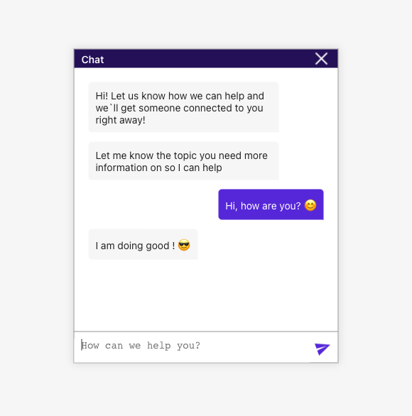

# Chat Bot App

## Demo link:
Access my site at [saurabhchavan.github.io/author-ai](https://saurabhchavan.github.io/author-ai/)

## Table of Content:

- [Chat Bot App](#author-ai-app)
  - [Demo link:](#demo-link)
  - [Table of Content:](#table-of-content)
  - [About Chat Bot App](#about-author-ai-app)
  - [Screenshots](#screenshots)
  - [Technologies](#technologies)
  - [Setup](#setup)
    - [`npm run build`](#npm-run-build)
  - [Approach](#approach)
  - [Status](#status)
  - [Credits](#credits)
  - [License](#license)

## About Chat Bot App
Chat Window app is build using react to demonstrate an interaction a user and return an automated response.

## Screenshots

## Technologies
I used `HTML`, `CSS`, `React`

## Setup

This project was bootstrapped with [Create React App](https://github.com/facebook/create-react-app).

- download or clone the repository

In the project directory, you can run:

- run `npm install`
- To start the application run `npm start`

Runs the app in the development mode.\
Open [http://localhost:3000](http://localhost:3000) to view it in your browser.

The page will reload when you make changes.\
You may also see any lint errors in the console.

- To run unit tests `npm test`

Launches the test runner in the interactive watch mode.\
See the section about [running tests](https://facebook.github.io/create-react-app/docs/running-tests) for more information.

### `npm run build`

Builds the app for production to the `build` folder.\
It correctly bundles React in production mode and optimizes the build for the best performance.

The build is minified and the filenames include the hashes.\
Your app is ready to be deployed!

## Approach
I adopted the `BEM` naming style for my css class names and ...

## Status
Chat Window App is still in progress.
| Features | Status |
|--|--|
| Pre-defined responses in a JSON file |✅ |
| Ability to send a message | ✅ |
| Dynamically return responses for pre-defined input | ✅ |
| Style Incoming & Outgoing bubbles | ✅ |
| Error Validations  | 🚧 |
| Real Time Chat  | 🚧 |

`Version 2` will be out soon.

## Credits
List of contriubutors:
- [Saurabh Chavan](https://github.com/saurabhchavan)

## License
MIT license 